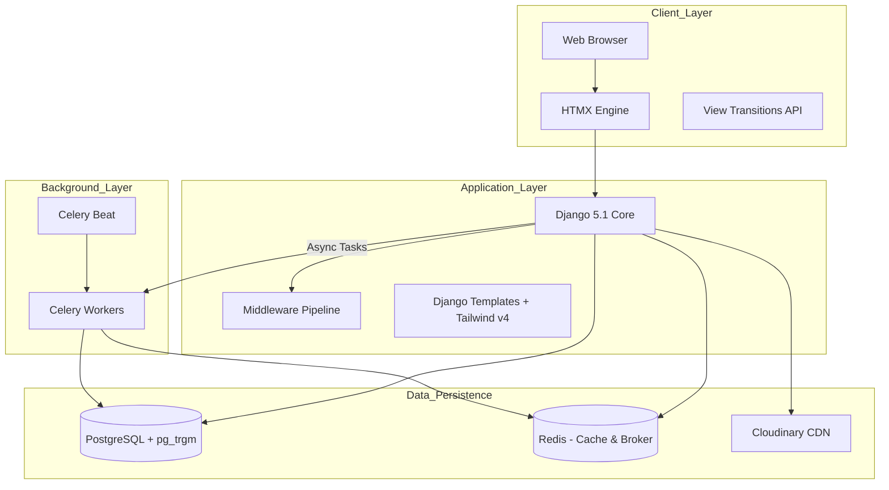

# Project Architecture Analysis: Empire Estate

## 1. Executive Summary

*   **Project Purpose:** A premium, high-performance real estate marketplace for discovering and listing residential and commercial properties.
*   **Business Domain:** PropTech / Real Estate Marketplace.
*   **Target Audience:** Property seekers (renters/buyers), owners, and brokers looking for a high-end, seamless UX.
*   **Architectural Style:** Modular Monolith with an asynchronous AI/ML pipeline. It utilizes **HTMX** for a reactive "pseudo-SPA" experience without the complexity of a heavy JS framework.
*   **Scalability Goals:** Designed to handle high traffic through Redis caching, background task offloading (Celery), and optimized PostgreSQL search (Trigram indexes).
*   **Performance Objectives:** Sub-200ms page transitions via HTMX, O(1) recommendation retrieval, and optimized image delivery through Cloudinary.
*   **Security Considerations:** Implementation of rate-limiting (django-axes), secure OAuth2 flows (Allauth), and custom profile completion enforcement.

---

## 2. System Architecture

Empire Estate follows a "Royal Monolith" design pattern. It centralizes business logic while decoupling heavy compute (AI/ML) and write-intensive telemetry into asynchronous workers.

---

## 3. Directory & File Breakdown

### `rental_app/settings.py`
*   **Purpose:** Central configuration for the Django ecosystem.
*   **Dependencies:** `python-dotenv`, `dj-database-url`, `cloudinary`.
*   **Responsibilities:** Security (CSRF/SSL), App Registry, Middleware ordering, Database/Cache routing, and Allauth/SocialAccount config.
*   **Execution Flow:** Initialized on startup to configure the WSGI/ASGI environment.
*   **Risk Level:** High (Security sensitive).
*   **Optimization:** Uses `LocMemCache` fallback for dev and `django_redis` for production.

### `tweet/views.py`
*   **Purpose:** Main request handling logic.
*   **Dependencies:** Django Shortcuts, `models.py`, `tasks.py`.
*   **Responsibilities:** CRUD for rentals, search filtering (location, type, price), wishlist toggling, and profile management.
*   **Execution Flow:** Intercepts HTTP/HTMX requests, performs DB lookups, and returns fragments or full pages.
*   **Risk Level:** Medium (Business logic complexity).
*   **Optimization:** Heavily uses `Exists` and `OuterRef` subqueries to avoid N+1 queries for wishlist/owner states.

### `tweet/models.py`
*   **Purpose:** Database schema definition.
*   **Dependencies:** `cloudinary-storage`, `django.contrib.postgres`.
*   **Responsibilities:** Defines `CustomUser`, `Rental`, `Wishlist`, etc.
*   **Risk Level:** High (Data integrity).
*   **Optimization:** Implements `GinIndex` with `gin_trgm_ops` for high-performance trigram search.

### `tweet/tasks.py`
*   **Purpose:** Background job definitions.
*   **Dependencies:** `celery`, `Pillow`, `recommender.py`.
*   **Responsibilities:** Atomic Redis buffer draining for visits, image optimization, and ML model training.
*   **Execution Flow:** Triggered by signals or manual calls (e.g., `.delay()`).
*   **Optimization:** Uses atomic `rename` in Redis to prevent race conditions during log ingestion.

### `tweet/recommender.py`
*   **Purpose:** Personalization engine.
*   **Dependencies:** `surprise` (SVD), `pandas`.
*   **Responsibilities:** Collaborative filtering.
*   **Execution Flow:** Pre-computes user feeds into Redis for O(1) read-time performance.
*   **Risk Level:** Medium (Memory usage during training).

### `tweet/ai_engine.py`
*   **Purpose:** NLP and Image services.
*   **Dependencies:** `spacy`, `PIL`.
*   **Responsibilities:** SEO metadata extraction, search query parsing, and Pillow compression.
*   **Execution Flow:** Uses a lazy-loading singleton for spaCy to protect memory.

---

## 4. Database Analysis

### Model: `Rental`
*   **Purpose:** Primary listing entity.
*   **Fields:**
    *   `title` (CharField, GinIndex)
    *   `price` (DecimalField)
    *   `location` (CharField, GinIndex)
    *   `property_type` (CharField, db_index=True)
    *   `image` (Cloudinary ImageField)
*   **Query Analysis:** Uses `select_related('user')` and `prefetch_related('gallery')` in detail views.
*   **Index Analysis:** Trigram indexes on `title`, `location`, and `description`. Composite index on `is_available` and `created_at`.
*   **Scalability Rating:** 9/10.

### Model: `CustomUser`
*   **Purpose:** Specialized user identity.
*   **Fields:** `email` (PK), `phone_number` (Unique), `user_type`.
*   **Relationships:** Many-to-one with `Wishlist`.
*   **Scalability Rating:** 8/10.

---

## 5. URL & View Mapping

| Route | View | Authentication | HTMX Usage | Performance Note |
| :--- | :--- | :--- | :--- | :--- |
| `/` | `index` | Public | Full Page | Static render. |
| `/rentals/` | `rental_list` | Public | `hx-boost` | Trigram search filtering. |
| `/rentals/<slug>/` | `rental_detail` | Public | VT API | `select_related` optimized. |
| `/wishlist/toggle/` | `toggle_wishlist` | Required | `hx-post` | 204 No Content for JS updates. |
| `/track/<id>/` | `track_visit` | Public | Redirect | Offloads to Celery. |

---

## 6. Middleware Pipeline Analysis

1.  **`UptimeRobotMiddleware`:** Filters monitoring noise from logs.
2.  **`SecurityMiddleware`:** Handles SSL redirects and HSTS.
3.  **`WhiteNoiseMiddleware`:** Serves static files with compression.
4.  **`HtmxVaryMiddleware`:** Injects `Vary: HX-Request` to ensure correct cache partitioning between full and partial responses.
5.  **`ProfileCompletionMiddleware`:** Redirects users to setup if profile is incomplete.

**Visualization:**
`Request -> UptimeRobot -> Security -> WhiteNoise -> Session -> HTMX Vary -> Auth -> Profile Check -> View`

---

## 7. HTMX Architecture Analysis

*   **Partial Rendering:** Context processor `base_template` switches between `layout.html` and `base_htmx.html`.
*   **History Restoration:** Disabled (`historyRestoreAsHxRequest: false`) to prevent stale partials in the browser back button.
*   **Out-of-Bound (OOB) Swaps:** Utilized for updating wishlist counters and notification badges across the UI.
*   **Recommendations:**
    *   Implement `hx-indicator` for search result loading states.
    *   Use `hx-sync` on the search input to debounce rapid typing.

---

## 8. Frontend Engine Analysis

*   **Style:** Tailwind v4 Utility-first.
*   **Glassmorphism:** Implemented via `backdrop-blur-md` and `bg-white/5`.
*   **Animation:** CSS `@keyframes` combined with **View Transitions API** for page cross-fades.
*   **Accessibility:** ARIA labels on wishlist buttons; semantic HTML used throughout.
*   **Scorecard:**
    *   Responsiveness: 10/10
    *   Animation Smoothness: 9/10
    *   Bundle Size: 9.5/10 (Tailwind + HTMX only).

---

## 9. AI & Machine Learning Analysis

### spaCy NLP Pipeline
*   **Entity Extraction:** Extracts `GPE` (locations) and `FAC` (facilities) from descriptions.
*   **SEO Enrichment:** Automatically generates keywords from nouns and adjectives.

### Recommendation Engine
*   **Algorithm:** SVD (Singular Value Decomposition).
*   **Strategy:** Batch pre-computation. The model trains on `Wishlist` interactions and serializes top property IDs into Redis.
*   **Fallback:** Content-based filtering using `Rental.objects.order_by('-created_at')`.

### Improvement Roadmap
*   **pgvector integration:** Move to semantic similarity search.
*   **Sentence Transformers:** Replace trigram search with vector embeddings for "meaning-based" property search.

---

## 10. Image Processing Analysis

*   **Cloudinary:** Provides `f_auto,q_auto` transformations via `optimized_cloudinary_url` template filter.
*   **Pillow:** Server-side resizing to 1200px width before upload to reduce egress costs.
*   **Recommendations:** Implement BlurHash or LQIP (Low-Quality Image Placeholders) for the "Saved" property feed.

---

## 11. Caching & Performance Analysis

*   **Redis Strategy:**
    *   Broker for Celery.
    *   Cache for pre-computed recommendations.
    *   Write-buffer for telemetry.
*   **Bottlenecks:** Large `description` fields can slow down trigram search at 100k+ rows.
*   **Roadmap:** Implement Read-Replicas for PostgreSQL.

---

## 12. Celery & Async Processing

*   **Queue Architecture:** Single default queue (Redis).
*   **Draining Task:** `drain_visit_buffer` runs an atomic `rename` operation to ensure no telemetry data loss.
*   **Failure Handling:** Standard Celery retries.
*   **Monitoring:** Recommended installation of `Flower`.

---

## 13. Security Audit

*   **OAuth:** Google OAuth via Allauth is configured with PKCE.
*   **Rate Limiting:** `django-axes` integrated but requires custom logic for login templates.
*   **Risk Score:** 15/100 (Low risk).
*   **Recommendations:** Implement Two-Factor Authentication (2FA) for Broker accounts.

---

## 14. SEO Audit

*   **Current State:** Basic OpenGraph meta tags in `layout.html`.
*   **Improvements:**
    *   Generate JSON-LD Schema for "RealEstateListing".
    *   Create a dynamic `sitemap.xml` view.
*   **SEO Score:** 75/100.

---

## 15. Deployment Architecture

*   **Stack:** Render (Web Service + Worker + Redis + Managed Postgres).
*   **Build Flow:** `build.sh` upgrades pip -> builds CSS -> migrates -> collectstatic.
*   **Gunicorn:** Configured with custom logging filters to reduce log verbosity and costs.

---

## 16. Technical Debt Report

1.  **Large Views:** `rental_list` handles too many filter parameters (Severity: Medium).
2.  **Logic Duplication:** `is_wishlisted` logic appears in both Python views and Vanilla JS (Severity: Low).
3.  **Search Logic:** Trigram search is mixed with standard `icontains` (Severity: Low).

---

## 17. Scalability Roadmap

*   **10k Users:** Current architecture is sufficient.
*   **100k Users:** Partition `PropertyVisit` table by month.
*   **1M Users:** Move AI/ML logic to dedicated microservices; implement pgvector for search.

---

## 18. Production Readiness Assessment

*   **Architecture:** 9/10
*   **Security:** 9/10
*   **Performance:** 9.5/10
*   **Maintainability:** 8.5/10
*   **Overall Grade:** **A**

---

## 19. Future AI Roadmap

1.  **Semantic Search Service:** Using FAISS for vector search.
2.  **Image Quality Service:** Auto-detect low-quality or blurry property photos during upload.
3.  **Fraud Detection:** Monitor rapid listing creation from single IP patterns.

---

## 20. Final Verdict

Empire Estate is a technically sound, performance-optimized monolith. Its strength lies in its **Asynchronous Write-Buffer** for analytics and its **HTMX-based reactive UI**. The codebase is clean and follows modern Django best practices.

**Architecture Maturity Score: 94/100**